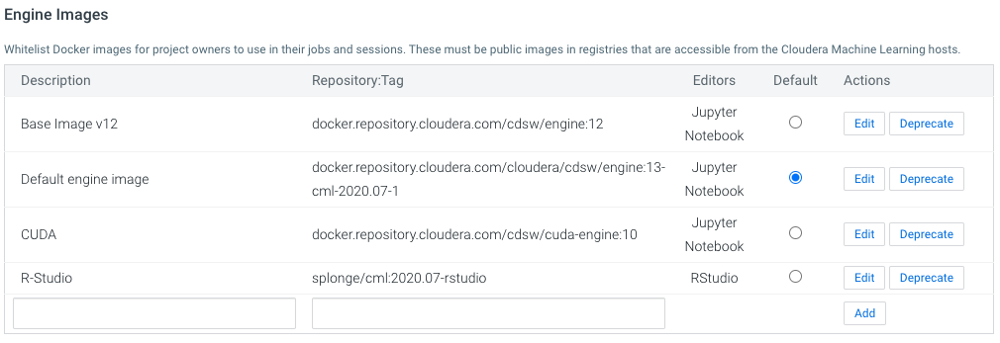
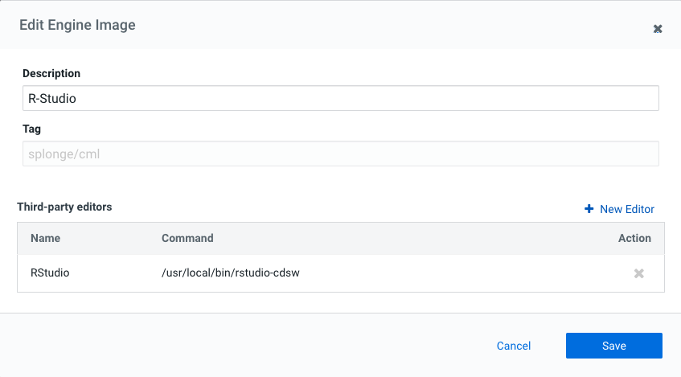
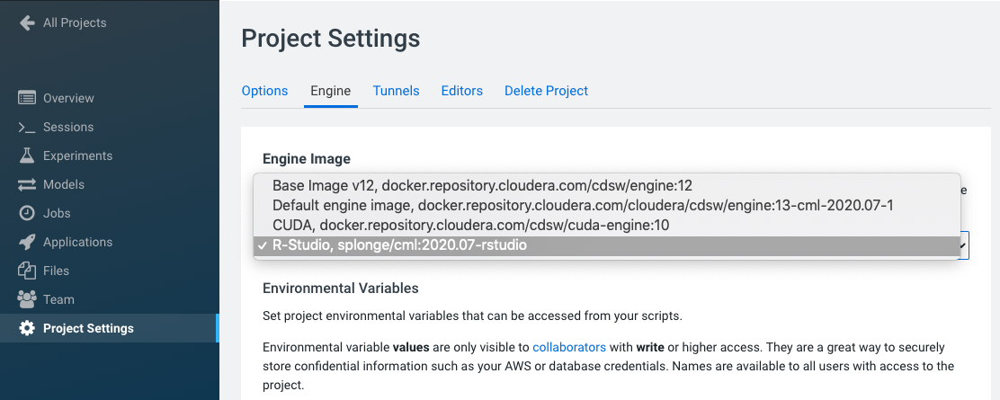
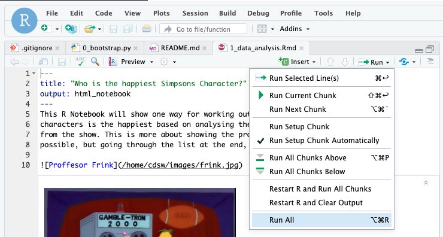

# Sentiment Analysis Prototype
This project is a Cloudera Machine Learning 
([CML](https://www.cloudera.com/products/machine-learning.html)) **Applied Machine Learning 
Project Prototype**. It has all the code and data needed to deploy an end-to-end machine 
learning project in a running CML instance.


Images Source: https://toddwschneider.com/posts/the-simpsons-by-the-data/

## Project Overview
This project builds two different Sentiment Analysis models. One model is based on text from 
the Simpsons TV show available on Kaggle [here](https://www.kaggle.com/pierremegret/dialogue-lines-of-the-simpsons) 
and uses **R code** (specifically [Sparklyr](https://spark.rstudio.com/)) to train the model. The other model is based on the Sentiment 140 dataset, 
also available on kaggle [here](https://www.kaggle.com/kazanova/sentiment140) and uses 
Tensorflow with GPU. The end result is an application that will send a test sentence to 
either of the deployed models and show the predicted sentiment result.


The goal is to build a senitment classifier model using various techniques to predict the 
senitment of a new sentence in real time.

By following the notebooks and scripts in this project, you will understand how to perform similar 
sentiment analysis tasks on CML as well as how to use the platform's major features to your 
advantage. These features include **working in different programing langues**, 
**using different engines**, **point-and-click model deployment**, and **ML app hosting**.

We will focus our attention on working within CML, using all it has to offer, while glossing over 
the details that are simply standard data science. 
We trust that you are familiar with typical data science workflows
and do not need detailed explanations of the code. Notes that are *specific to CML* will be e
mphasized in **block quotes**.

## *For both the R code and Python code models:*
### Initialize the Project
There are a couple of steps needed at the start to configure the Project and Workspace 
settings so each step will run sucessfully. You **must** run the project bootstrap 
before running other steps. If you just want to launch the model interpretability 
application without going through each step manually, then you can also deploy the 
complete project. 

***Project bootstrap***

Open the file `0_bootstrap.py` in a normal workbench `python3` session. You need a larger
instance of this to install tensorflow, at least a 1 vCPU / 8 GiB instance. Once the session 
is loaded, click **Run > Run All Lines**. 
This will file will create an Environment Variable for the project called **STORAGE**, 
which is the root of default file storage location for the Hive Metastore in the 
DataLake (e.g. `s3a://my-default-bucket`). It will also upload the data used in the 
project to `$STORAGE/datalake/data/sentiment/`. 

The original data files for R code comes as part of this git repo in the `data` folder. The
**R code** will 
For the Python code the data and model files are too big for a github project and will be
downloaded and created as part of the process. 


## Project Build
To build out the complete project, you need to go through each of the steps manually to build 
and understand how the project works. There is more detail and explanation/comments in each 
of the files/notebooks so its worth looking into those. Follow the steps below and you 
will end up with a running application.

## *For the R code models:*
**Engine Setup**
For those who are more comfortable running R-Studio as the text editor, or if you want to see
how the R notebook file renders, you need to setup R-Studio as a [web based editor](https://docs.cloudera.com/machine-learning/cloud/projects/topics/ml-editors-browser-engine.html). The process 
fairly straight forward, and for you now you can use an engine that has been uploaded to docker
hub to make this easier: `splonge/cml:2020.07-rstudio` but you can follow the documented process
and upload the resulting engine image to any accessable docker repo. To add the engine, you will
need admin access to CML. In the **Admin > Engines** section, add a new engine as the per the 
image below:



The next step after adding the engine is to configure R-Studio as an editor.
In the **Admin > Engines** section, click **Edit** on the newly added enging and add in the command to launch R  Studio `/usr/local/bin/rstudio-cdsw`



### 1 Data Analysis (R Code)
This file is an R notebook file that creates the datasets and hive tables necessary to train the
model in the next step. To run this file, you need to open in an R-Studio session. In the **Project 
Settings** section, change the project engine to the R-Studio engine created in the previous
step.



Then launch a new R-Studio session with the R-Studio engine: 1 CPU, 4 GB. Then open the file 
`R Code/1_data_analysis.Rmd`. In the file editor in R-Studio, click on **Run > Run All** and the 
notebook code will execute and create the tables needed in the next step. 




### 2 Model Training (R Code)
<!-- This is a Jupyter Notebook that does some basic data exploration and visualistaion. It 
is to show how this would be part of the data science workflow.


Open a Jupyter Notebook session (rather than a work bench): python3, 1 CPU, 2 GB and 
open the `2_data_exploration.ipynb` file. 

At the top of the page click **Cells > Run All**. -->

A model pre-trained is saved with the repo has been and placed in the `models` directory. 
If you want to retrain the model, open the `4_train_models.py` file in a workbench  session: 
python3 1 vCPU, 2 GiB and run the file. The newly model will be saved in the models directory 
named `telco_linear`. 

The other ways of running the model training process is by running a job. 

***Jobs***

The **[Jobs](https://docs.cloudera.com/machine-learning/cloud/jobs-pipelines/topics/ml-creating-a-job.html)**
feature allows for adhoc, recurring and depend jobs to run specific scripts. To run this model 
training process as a job, create a new job by going to the Project window and clicking _Jobs >
New Job_ and entering the following settings:
* **Name** : Train Mdoel
* **Script** : 4_train_models.py
* **Arguments** : _Leave blank_
* **Kernel** : Python 3
* **Schedule** : Manual
* **Engine Profile** : 1 vCPU / 2 GiB
The rest can be left as is. Once the job has been created, click **Run** to start a manual 
run for that job.

### 3 Model Serving (R Code)
<!-- This is also a Jupyter Notebook to show the process of selecting and building the model 
to predict churn. It also shows more details on how the LIME model is created and a bit 
more on what LIME is actually doing.

Open a Jupyter Notebook session (rather than a work bench): python3, 1 CPU, 2 GB and 
open the `	3_model_building.ipynb` file. 

At the top of the page click **Cells > Run All**. -->

The **[Models](https://docs.cloudera.com/machine-learning/cloud/models/topics/ml-creating-and-deploying-a-model.html)** 
is used top deploy a machine learning model into production for real-time prediction. To 
deploy the model trailed in the previous step, from  to the Project page, click **Models > New
Model** and create a new model with the following details:

* **Name**: Explainer
* **Description**: Explain customer churn prediction
* **File**: 5_model_serve_explainer.py
* **Function**: explain
* **Input**: 
```
{
	"sentence": "I have had a fantastic day",
}
```
* **Kernel**: R
* **Engine Profile**: 1vCPU / 4 GiB Memory

Leave the rest unchanged. Click **Deploy Model** and the model will go through the build 
process and deploy a REST endpoint. Once the model is deployed, you can test it is working 
from the model Model Overview page.

_**Note: This is important**_

Once the model is deployed, you must disable the additional model authentication feature. In the model settings page, untick **Enable Authentication**.


## *For the Python code models:*
### 1 Data Injest (Python Code)

### 2 Model Training (Python Code)
A model pre-trained is saved with the repo has been and placed in the `models` directory. 
If you want to retrain the model, open the `4_train_models.py` file in a workbench  session: 
python3 1 vCPU, 2 GiB and run the file. The newly model will be saved in the models directory 
named `telco_linear`. 

The other ways of running the model training process is by running a job. 

***Jobs***

The **[Jobs](https://docs.cloudera.com/machine-learning/cloud/jobs-pipelines/topics/ml-creating-a-job.html)**
feature allows for adhoc, recurring and depend jobs to run specific scripts. To run this model 
training process as a job, create a new job by going to the Project window and clicking _Jobs >
New Job_ and entering the following settings:
* **Name** : Train Mdoel
* **Script** : 4_train_models.py
* **Arguments** : _Leave blank_
* **Kernel** : Python 3
* **Schedule** : Manual
* **Engine Profile** : 1 vCPU / 2 GiB
The rest can be left as is. Once the job has been created, click **Run** to start a manual 
run for that job.

### 3 Data Analysis and Model Training Notebook (Python Code)

### 4 Model Serving (Python Code)

## *For both the R code and Python code models:*

### 5 Deploy Application
The next step is to deploy the Flask application. The **[Applications](https://docs.cloudera.com/machine-learning/cloud/applications/topics/ml-applications.html)** feature is still quite new for CML. For this project it is used to deploy a web based application that interacts with the underlying model created in the previous step.

_**Note: This next step is important**_

_In the deployed model from step 5, go to **Model > Settings** and make a note (i.e. copy) the 
"Access Key". It will look something like this (ie. mukd9sit7tacnfq2phhn3whc4unq1f38)_

_From the Project level click on "Open Workbench" (note you don't actually have to Launch a 
session) in order to edit a file. Select the flask/single_view.html file and paste the Access 
Key in at line 19._

```
fetch_result <- function (sentence, model) {
  if (model == "simp") {
    accessKey <-  "mfd0yk8o4tfi13uua8hc9gzqxej0jc2s"
  }
  else {
    accessKey <-  "m7zzyhlbtr3ovq3tvaa2myowglhzpf3f"
  }
```
`        const accessKey = "mp3ebluylxh4yn5h9xurh1r0430y76ca";`

_Save the file (if it has not auto saved already) and go back to the Project._

From the Go to the **Applications** section and select "New Application" with the following:
* **Name**: Churn Analysis App
* **Subdomain**: churn-app _(note: this needs to be unique, so if you've done this before, 
pick a more random subdomain name)_
* **Script**: 6_application.py
* **Kernel**: Python 3
* **Engine Profile**: 1vCPU / 2 GiB Memory


After the Application deploys, click on the blue-arrow next to the name. The initial view is a 
table of randomly selected from the dataset. This shows a global view of which features are 
most important for the predictor model. The reds show incresed importance for preditcting a 
cusomter that will churn and the blues for for customers that will not.


Clicking on any single row will show a "local" interpreted model for that particular data point 
instance. Here you can see how adjusting any one of the features will change the instance's 
churn prediction.


Changing the InternetService to DSL lowers the probablity of churn. *Note: this does not mean 
that changing the Internet Service to DSL cause the probability to go down, this is just what 
the model would predict for a customer with those data points*


  