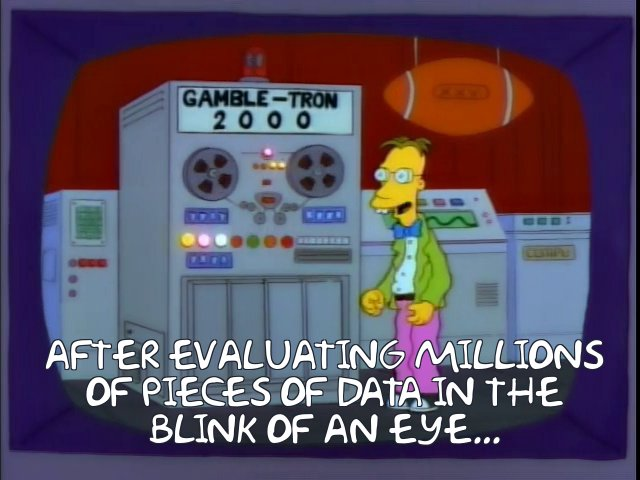

# Sentiment Analysis Prototype
This project is a Cloudera Machine Learning 
([CML](https://www.cloudera.com/products/machine-learning.html)) **Applied Machine Learning 
Project Prototype**. It has all the code and data needed to deploy an end-to-end machine 
learning project in a running CML instance.

Images Source: https://toddwschneider.com/posts/the-simpsons-by-the-data/

## Project Overview
This project builds two different Sentiment Analysis models. One is based on text from the Simpsons TV show available on Kaggle [here](https://www.kaggle.com/pierremegret/dialogue-lines-of-the-simpsons) and uses Sparklyr to train the model. The other is based on the Sentiment 140 dataset, also available on kaggle [here](https://www.kaggle.com/kazanova/sentiment140) and uses Tensorflow with GPU. The end result is an application that will send a test sentence to either of the deployed models and show the predicted sentiment result.

The goal is to build a senitment classifier model using various techniques to predict the senitment of a new sentence in real time.

By following the notebooks and scripts in this project, you will understand how to perform similar 
sentiment analysis tasks on CML as well as how to use the platform's major features to your 
advantage. These features include **working in different programing langues**, **using different engines**, 
**point-and-click model deployment**, and **ML app hosting**.

We will focus our attention on working within CML, using all it has to offer, while glossing over the details that are simply standard data science. 
We trust that you are familiar with typical data science workflows
and do not need detailed explanations of the code. Notes that are *specific to CML* will be emphasized in **block quotes**.